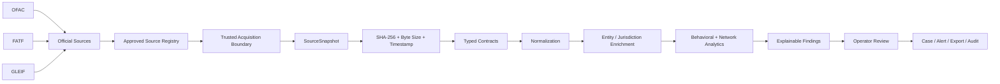
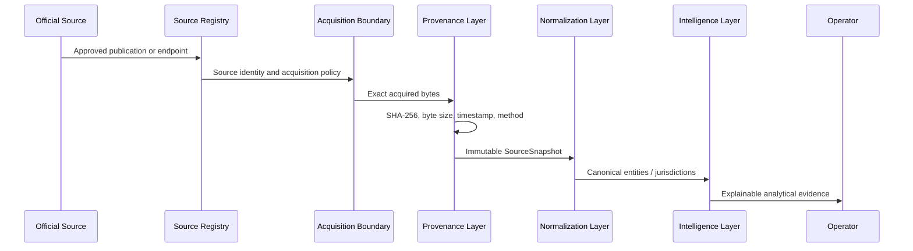
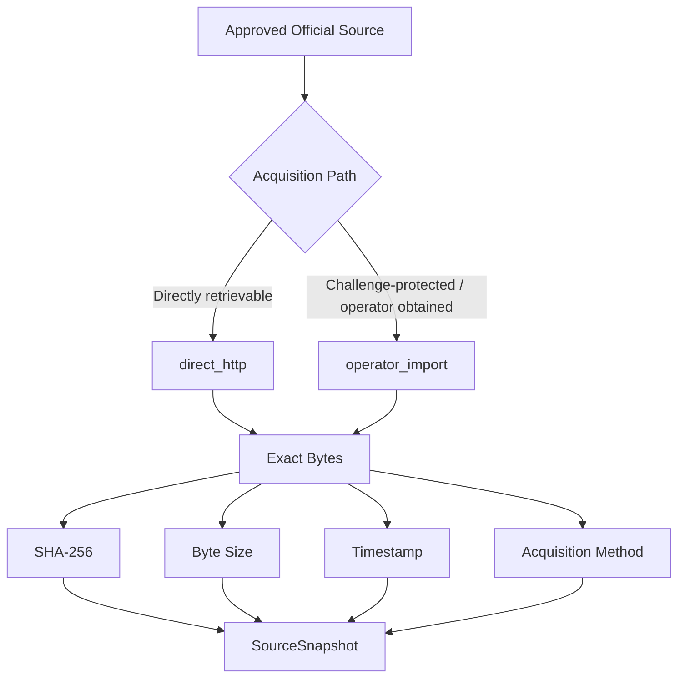

<div align="center">

# Operation Black Meridian

### Provenance-Aware Operational Financial Intelligence

[](https://github.com/valeriusvarda/operation-black-meridian/actions/workflows/quality.yml)


**Official-source intelligence · Cryptographic provenance · Jurisdiction risk · Entity context · Explainable analytical operations**

</div>

---

## Executive Brief

**Operation Black Meridian** is an operational financial-intelligence platform for transforming official external data and controlled transaction behavior into **traceable, reproducible, and reviewable analytical evidence**.

The system is built around one requirement:

> **No material analytical conclusion should be stronger than the evidence chain that supports it.**

A jurisdiction classification, sanctions record, anomaly score, network relationship, or behavioral alert should therefore remain connected to its approved source identity, exact acquired bytes, acquisition method, cryptographic digest, normalization logic, transformation history, analytical assumptions, and operator-reviewable explanation.

Operation Black Meridian is not being built as a dashboard first.

It is being built as an **evidence system**.

---

## The Problem

Financial intelligence rarely comes from one clean dataset.
A defensible assessment may require the interaction of:

- official jurisdiction-risk classifications,
- sanctions and designated-party records,
- legal-entity reference data,
- transaction timing and velocity,
- cross-border exposure,
- counterparty concentration,
- behavioral deviation,
- network proximity,
- source freshness,
- and analytical uncertainty.

Static lists, undocumented CSV files, opaque scoring rules, and decorative dashboards are not sufficient for serious operational analysis.

Operation Black Meridian is designed to connect those layers into a reconstructable chain from **official source to operator assessment**.

---

## Core System Thesis

```text
OFFICIAL SOURCE
      ↓
SOURCE IDENTITY
      ↓
ACQUISITION
      ↓
PROVENANCE
      ↓
CANONICALIZATION
      ↓
ENRICHMENT
      ↓
ANALYTICS
      ↓
EXPLANATION
      ↓
OPERATOR DECISION
      ↓
AUDITABLE EVIDENCE
```

The platform deliberately sits between raw source ingestion and final human judgment.

It does not replace the analyst.

It strengthens the analyst's evidence.

---

## Intelligence Architecture



---

## Evidence Lifecycle



---

## Why the Architecture Matters

### Provenance is part of the data model

A trusted source is not merely downloaded.

The acquisition becomes evidence.

`SourceSnapshot` records:

```text
source_key
acquisition_method
requested_url
resolved_url
fetched_at
sha256
byte_size
content_type
destination
```

Acquisition methods are modeled explicitly:

```text
direct_http
operator_import
```

A file obtained through operator-assisted acquisition must never later be represented as an automated HTTP retrieval.

### Unknown identities fail closed

Jurisdiction normalization rejects identities that cannot be resolved safely to a canonical ISO alpha-3 code.

Uncertainty is surfaced instead of silently converted into downstream risk.

### Serialization is deterministic

Validated intelligence is rendered predictably into machine-readable forms so CSV and JSON outputs can be reconciled against the same canonical analytical state.

### Generated evidence stays outside Git history

Raw source snapshots, provenance manifests, generated reference data, and analytical outputs are runtime evidence — not source code.

### Responsibilities remain separated

The acquisition layer retrieves bytes.

The parser interprets source structure.

The normalizer resolves canonical identities.

The workflow reconciles provenance.

The operator decides what the evidence means.

---

## Trusted Source Boundary

The approved registry currently establishes official-source identities for:

| Publisher | Intelligence role |
|---|---|
| U.S. Department of the Treasury — OFAC | Sanctions and designated-party reference data |
| Financial Action Task Force — FATF | High-risk and increased-monitoring jurisdictions |
| Global Legal Entity Identifier Foundation — GLEIF | Legal Entity Identifier reference data |

The command surface resolves registered source keys rather than treating arbitrary URLs as trusted intelligence inputs.

---

## Acquisition Model

Operation Black Meridian distinguishes **source trust** from **transport success**.



### Challenge-protected official sources

The FATF public site currently presents an automated Cloudflare challenge to the project's direct HTTP acquisition path.

The project does **not** treat anti-bot circumvention as a trusted engineering solution.

The implemented controlled operator-assisted import path preserves:

- approved source identity,
- exact imported bytes,
- SHA-256,
- byte size,
- timestamp,
- destination,
- and explicit `operator_import` provenance.

Operator-assisted acquisition is recorded explicitly as `operator_import`. It does not claim an HTTP-observed redirect or server response for the imported artifact.

The intelligence pipeline remains downstream of that acquisition boundary.

---

## FATF Jurisdiction Intelligence

The FATF workstream is the first complete official-source intelligence adapter implemented through the platform.

```text
OFFICIAL FATF PUBLICATION
          ↓
SOURCE IDENTITY
          ↓
ACQUISITION PROVENANCE
          ↓
PUBLICATION DATE
          ↓
RISK-TIER PARSING
          ↓
JURISDICTION NORMALIZATION
          ↓
ISO ALPHA-3 IDENTITIES
          ↓
VALIDATED FatfSnapshot
          ↓
DETERMINISTIC CSV / JSON
          ↓
CLI ORCHESTRATION
```

### Current FATF capability

| Capability | State |
|---|---|
| Typed jurisdiction contracts | Implemented |
| Risk-tier model | Implemented |
| Deterministic HTML parser | Implemented |
| Publication-date extraction | Implemented |
| High-risk jurisdiction parsing | Implemented |
| Increased-monitoring parsing | Implemented |
| Fail-closed jurisdiction normalization | Implemented |
| ISO alpha-3 normalization | Implemented |
| Deterministic CSV serialization | Implemented |
| Deterministic JSON serialization | Implemented |
| Atomic evidence writers | Implemented |
| Source byte-size reconciliation | Implemented |
| Source SHA-256 reconciliation | Implemented |
| End-to-end FATF evidence workflow | Implemented |
| `fatf refresh` CLI orchestration | Implemented |
| Offline CLI regression coverage | Implemented |
| Acquisition-method provenance | Implemented |
| Direct live FATF HTTP acquisition | Externally challenge-protected |
| Controlled operator-assisted import | Implemented |

The governing workstream is GitHub Issue `#7`: **Real data: ingest current FATF jurisdiction risk intelligence**.

---

## OFAC Entity Intelligence

The OFAC workstream implements a provenance-bound entity-evidence adapter over the complete approved legacy SDN and Consolidated Non-SDN CSV series.

```text
OFFICIAL OFAC PUBLICATIONS
          ↓
APPROVED SOURCE REGISTRY
          ↓
8 SOURCE SNAPSHOTS
          ↓
SOURCE SHA-256 + BYTE SIZE
          ↓
DETERMINISTIC EVIDENCE-SET IDENTITY
          ↓
PRIMARY + ADDRESS + ALIAS + COMMENTS PARSERS
          ↓
SOURCE-SCOPED PUBLISHER IDENTITY
          ↓
PUBLISHER-GROUNDED ENTITY EVIDENCE
          ↓
DETERMINISTIC JSON / CSV
          ↓
OPERATOR CLI
          ↓
PROVENANCE-BOUND VISUAL EVIDENCE
```

### Approved OFAC evidence boundary

The adapter treats the OFAC legacy publications as related publisher artifacts rather than assuming that one primary CSV represents a complete entity record.

The approved SDN series consists of:

```text
SDN.CSV
ADD.CSV
ALT.CSV
SDN_COMMENTS.CSV
```

The approved Consolidated Non-SDN series consists of:

```text
CONS_PRIM.CSV
CONS_ADD.CSV
CONS_ALT.CSV
CONS_COMMENTS.CSV
```

Every artifact is preserved as an independent `SourceSnapshot` with its own acquisition provenance, byte size, SHA-256 digest, timestamp, and approved source identity.

The complete eight-source composition is represented by an immutable `OfacEvidenceSet`.

Its evidence-set fingerprint is derived deterministically from:

* canonical source-key ordering,
* exact source SHA-256 values,
* and exact source byte sizes.

### Source-scoped publisher identity

The canonical occurrence identity is deliberately defined as:

```text
(source_key, publisher_record_id)
```

A bare OFAC linking integer is not treated as a globally unique real-world entity identifier.

This prevents records appearing in different approved publication families from being silently collapsed merely because their publisher identifiers overlap.

### Publisher-grounded relations

The entity evidence model preserves the publisher-defined relational structure:

```text
PRIMARY
  │
  ├── ADDRESS   1:N
  ├── ALIAS     1:N
  └── COMMENTS  0..1
```

Addresses and aliases are attached only through publisher-provided linking identifiers.

Orphan relations fail closed.

Comments spillover remains distinct from the primary remarks field while allowing exact reconstruction without inserting analytical text between publisher fragments.

### Deterministic evidence outputs

Validated OFAC evidence can be serialized as:

```text
ofac_entities.json
ofac_entities.csv
```

The JSON representation preserves:

* portable source provenance,
* evidence-set identity,
* source-scoped primary identity,
* raw publisher fields,
* deterministic subject classification,
* addresses,
* aliases,
* comments spillover,
* row fingerprints,
* source SHA-256 lineage,
* and reconstructed remarks.

The CSV representation emits one deterministic row per source-scoped primary evidence occurrence and retains nested relation evidence through deterministic embedded JSON fields.

Generated source and evidence artifacts remain outside Git history.

### Operational workflow

The operator-facing workflow acquires the complete approved source series through the existing trusted acquisition boundary.

```text
APPROVED SOURCE REGISTRY
          ↓
TRUSTED ACQUISITION
          ↓
8 SourceSnapshot OBJECTS
          ↓
OfacEvidenceSet
          ↓
STRUCTURAL PARSING
          ↓
RELATION RECONCILIATION
          ↓
ENTITY EVIDENCE
          ↓
JSON / CSV EXPORT
          ↓
OPERATOR SUMMARY
```

The workflow surfaces source identities, source-level SHA-256 values, byte counts, acquisition metadata, evidence-set identity, entity counts, relation counts, manifests, and generated output locations.

### Provenance-bound visual evidence

The visualization layer consumes the validated exported OFAC JSON rather than independently reparsing the raw publisher files.

Before rendering, it independently reconciles:

* the complete eight-source boundary,
* evidence-set SHA-256,
* source-level SHA-256 values,
* source-scoped primary identities,
* relation parent identities,
* source-derived subject classifications,
* and reconstructed remarks lineage.

Generated artifacts include:

```text
ofac_provenance_graph.svg
ofac_subject_composition.svg
ofac_raw_program_contexts.svg
ofac_visual_manifest.json
```

The visual manifest binds each rendered artifact to the exact exported evidence JSON through SHA-256.

The raw program-context visualization counts exact publisher field values. It does not silently split, normalize, or reinterpret composite program strings.

### Analytical boundary

This adapter does **not** implement:

* fuzzy sanctions-name matching,
* probabilistic person or organization resolution,
* GLEIF enrichment,
* transaction-level sanctions conclusions,
* autonomous compliance decisions,
* legal interpretation,
* guilt determination,
* criminal-intent inference.

A canonical OFAC record represents publisher-grounded source evidence.

It is not an analytical verdict.

The governing workstream is GitHub Issue `#23`: **Entity intelligence: canonicalize OFAC sanctions records with provenance**.

---

## Current Capability Boundary

| Capability                                  | Status      |
| ------------------------------------------- | ----------- |
| Reproducible Python 3.13 package            | Implemented |
| Locked dependency environment               | Implemented |
| Ruff linting and formatting                 | Implemented |
| Strict MyPy validation                      | Implemented |
| Pytest regression suite                     | Implemented |
| Coverage evidence                           | Implemented |
| Hosted GitHub Actions quality gate          | Implemented |
| Wheel and source-distribution builds        | Implemented |
| Trusted source registry                     | Implemented |
| Integrity-aware direct HTTP acquisition     | Implemented |
| SHA-256 source hashing                      | Implemented |
| Streaming byte accounting                   | Implemented |
| Atomic source replacement                   | Implemented |
| Machine-readable provenance manifests       | Implemented |
| Acquisition-method classification           | Implemented |
| Source discovery CLI                        | Implemented |
| Approved-source retrieval CLI               | Implemented |
| FATF parser / normalizer / exporter         | Implemented |
| FATF integrity-reconciliation workflow      | Implemented |
| FATF CLI orchestration                      | Implemented |
| Challenge-aware operator import             | Implemented |
| Complete OFAC legacy source-series registry | Implemented |
| OFAC evidence-set fingerprinting            | Implemented |
| Typed OFAC primary contracts                | Implemented |
| OFAC address / alias / comments relations   | Implemented |
| Publisher-grounded OFAC entity evidence     | Implemented |
| Deterministic OFAC JSON / CSV evidence      | Implemented |
| OFAC integrity-reconciliation workflow      | Implemented |
| `ofac refresh` CLI orchestration            | Implemented |
| Provenance-bound OFAC visual evidence       | Implemented |
| `ofac visualize` CLI orchestration          | Implemented |
| GLEIF entity enrichment                     | Planned     |
| Transaction-behavior engine                 | Planned     |
| Counterparty network intelligence           | Planned     |
| Explainable risk attribution                | Planned     |
| Operator case-management surface            | Planned     |
| Broader visual intelligence suite           | Planned     |

---

## Command Surface

### Inspect the application

```bash
uv run black-meridian --help
```

### List approved sources

```bash
uv run black-meridian sources list
```

### Retrieve an approved source

```bash
uv run black-meridian sources fetch ofac_sdn_csv
```

### Inspect OFAC commands

```bash
uv run black-meridian ofac --help
uv run black-meridian ofac refresh --help
uv run black-meridian ofac visualize --help
```

### Build current OFAC evidence

```bash
uv run black-meridian ofac refresh \
  --source-dir data/raw/external \
  --output-dir data/reference/ofac
```

The refresh path retrieves the complete approved OFAC source series through the trusted acquisition boundary, persists source provenance manifests, constructs the complete evidence-set identity, parses publisher-grounded primary and relation records, rejects provenance or relational inconsistencies, and emits deterministic JSON and CSV evidence.

### Render OFAC visual evidence

```bash
uv run black-meridian ofac visualize \
  --evidence data/reference/ofac/ofac_entities.json \
  --output-dir reports/generated/ofac
```

The visualization path validates the exported evidence before rendering and produces SHA-256-bound visual artifacts under `reports/generated/ofac`.

Generated visual evidence remains outside Git history.

### Inspect FATF commands

```bash
uv run black-meridian fatf --help
uv run black-meridian fatf refresh --help
uv run black-meridian fatf import --help
```

### Direct FATF refresh path

```bash
uv run black-meridian fatf refresh
```

The direct path retrieves the approved FATF source through the trusted HTTP acquisition boundary, records `direct_http` provenance, persists the acquisition manifest, reconciles source integrity, and generates validated evidence.

### Operator-assisted FATF import path

```bash
uv run black-meridian fatf import \
  /path/to/fatf-black-and-grey-lists.html
```

The operator-assisted path imports the exact operator-provided bytes into canonical trusted storage, records `operator_import` provenance, persists the acquisition manifest, and executes the same integrity-checked FATF evidence workflow.

This path does not bypass upstream access controls and does not represent the imported artifact as a direct HTTP retrieval.

---

## Evidence Guarantees

Operation Black Meridian treats the following properties as engineering requirements:

- **Source identity** — trusted acquisition begins from an approved source definition.
- **Exact-byte integrity** — SHA-256 is calculated over the acquired bytes.
- **Byte-size reconciliation** — downstream workflows verify source size against acquisition provenance.
- **Immutable provenance** — snapshot metadata uses frozen typed contracts.
- **Time awareness** — provenance timestamps must be timezone-aware.
- **Fail-closed normalization** — unknown identities are rejected instead of guessed.
- **Atomic publication** — temporary sibling files and atomic replacement reduce partial-write risk.
- **Deterministic outputs** — evidence formats remain reproducible and reconcilable.

---

## Trust Model

The platform separates four questions that are often incorrectly collapsed into one:

```text
1. Is this an approved source?
2. How did these exact bytes enter the system?
3. Can the transformation into canonical intelligence be reproduced?
4. What analytical conclusion is justified by that evidence?
```

A positive answer to one does not automatically imply a positive answer to the others.

That separation is central to the project.

---

## Analytical Direction

The long-term intelligence layer is designed around the interaction of:

```text
JURISDICTION RISK
        +
SANCTIONS EXPOSURE
        +
LEGAL-ENTITY CONTEXT
        +
TEMPORAL BEHAVIOR
        +
COUNTERPARTY STRUCTURE
        +
NETWORK EXPOSURE
        +
BASELINE DEVIATION
        ↓
EXPLAINABLE RISK EVIDENCE
        ↓
OPERATOR REVIEW
```

The system is designed to explain **why** a finding exists rather than merely emit a score.

Future bounded operator actions include:

```text
review
escalate
dismiss
monitor
export
```

The platform is not designed to declare guilt, criminal intent, or legal liability.

---

## Repository Structure

```text
operation-black-meridian/
├── .github/
│   ├── ISSUE_TEMPLATE/
│   ├── workflows/
│   │   └── quality.yml
│   └── pull_request_template.md
├── .vscode/
├── data/
│   ├── raw/
│   ├── reference/
│   ├── processed/
│   └── exports/
├── reports/
├── src/
│   └── black_meridian/
│       ├── data_sources/
│       │   ├── __init__.py
│       │   ├── contracts.py
│       │   ├── fetcher.py
│       │   ├── importer.py
│       │   ├── models.py
│       │   └── registry.py
│       ├── fatf/
│       │   ├── __init__.py
│       │   ├── exporter.py
│       │   ├── normalizer.py
│       │   ├── parser.py
│       │   └── workflow.py
│       ├── ofac/
│       │   ├── __init__.py
│       │   ├── aggregate.py
│       │   ├── cli.py
│       │   ├── comments.py
│       │   ├── contracts.py
│       │   ├── evidence.py
│       │   ├── exporter.py
│       │   ├── parser.py
│       │   ├── relations.py
│       │   ├── visualization.py
│       │   └── workflow.py
│       └── cli.py
├── tests/
│   ├── fixtures/
│   ├── test_cli.py
│   ├── test_fatf_exporter.py
│   ├── test_fatf_normalizer.py
│   ├── test_fatf_parser.py
│   ├── test_fatf_workflow.py
│   ├── test_ofac_aggregate.py
│   ├── test_ofac_cli.py
│   ├── test_ofac_comments.py
│   ├── test_ofac_contracts.py
│   ├── test_ofac_evidence.py
│   ├── test_ofac_exporter.py
│   ├── test_ofac_parser.py
│   ├── test_ofac_relations.py
│   ├── test_ofac_visualization.py
│   ├── test_ofac_workflow.py
│   ├── test_package_contract.py
│   ├── test_source_fetcher.py
│   ├── test_source_importer.py
│   ├── test_source_models.py
│   └── test_source_registry.py
├── pyproject.toml
├── uv.lock
└── README.md
```

Generated external and reference artifacts are intentionally excluded from Git history.

---

## Installation

### Requirements

- Git
- Python 3.13
- `uv`

### Clone and synchronize

```bash
git clone https://github.com/valeriusvarda/operation-black-meridian.git
cd operation-black-meridian

uv sync --locked --all-groups
```

### Inspect the CLI

```bash
uv run black-meridian --help
```

---

## Quality Boundary

The local gate mirrors the major hosted validation boundary:

```bash
uv sync --locked --all-groups

uv run ruff check .
uv run ruff format --check .
uv run mypy src
uv run pytest

uv build
```

The hosted workflow validates locked environment synchronization, Ruff linting and formatting, strict MyPy analysis, Pytest with coverage, package construction, and publication of quality/package artifacts.

---

## Engineering Protocol

```text
REAL PROBLEM
    ↓
GITHUB ISSUE
    ↓
SCOPED BRANCH
    ↓
AUDITABLE COMMITS
    ↓
LOCAL QUALITY GATE
    ↓
PULL REQUEST
    ↓
HOSTED CI
    ↓
REVIEW
    ↓
MERGE
```

A material change should be able to answer:

- What problem is being solved?
- What trust boundary changes?
- What evidence demonstrates correctness?
- What remains unproven?
- What failure modes were tested?
- What claims are intentionally not being made?

---

## Engineering Principles

### Evidence before claims

README statements should not outrun repository evidence.

### Provenance before interpretation

Analytical outputs remain connected to source identity and exact source content.

### Explicit uncertainty before silent assumptions

Unknown identities and unsupported transformations should fail visibly.

### Separation of concerns before convenience

Acquisition, parsing, normalization, analytics, and operator judgment remain separate layers.

### Behavior before isolated rows

Transaction intelligence should model temporal and relational behavior rather than independent records.

### Explainability before scoring

A score without attributable evidence is insufficient for operational review.

### Reproducibility before presentation

A visual is not intelligence evidence unless its source data and generation path can be reconstructed.

### Human judgment remains in the loop

The system supports review; it does not claim autonomous legal or criminal conclusions.

---

## Failure Model

The platform is being designed against practical failure modes including:

- stale official-source data,
- source-page structural changes,
- incomplete downloads,
- mutated local artifacts,
- provenance mismatch,
- unknown jurisdiction names,
- normalization drift,
- inconsistent CSV / JSON outputs,
- partial publication,
- challenge-protected official websites,
- opaque analytical scoring,
- accidental generated-artifact commits,
- and analyst overinterpretation of contextual risk signals.

The goal is not to pretend these risks disappear.

The goal is to make them **observable, testable, and reviewable**.

---

## Roadmap

### Phase I — Evidence Foundation

- [x] Reproducible Python package
- [x] Strict quality boundary
- [x] Hosted CI evidence
- [x] Approved-source registry
- [x] Integrity-aware HTTP acquisition
- [x] SHA-256 provenance
- [x] Acquisition-method model
- [x] Operator-assisted official-source import

### Phase II — Jurisdiction Intelligence

- [x] FATF contracts
- [x] FATF parser
- [x] Publication-date extraction
- [x] ISO alpha-3 normalization
- [x] Deterministic CSV / JSON evidence
- [x] Integrity-reconciled workflow
- [x] CLI orchestration
- [x] Complete live FATF evidence cycle through operator-import fallback

### Phase III — Entity Intelligence

- [ ] Canonical OFAC sanctions entities
- [ ] Sanctions-program modeling
- [ ] GLEIF LEI enrichment
- [ ] Cross-source entity reconciliation

### Phase IV — Behavioral Intelligence

- [ ] Controlled transaction dataset boundary
- [ ] Temporal behavior features
- [ ] Velocity and concentration indicators
- [ ] Counterparty graph model
- [ ] Network exposure analytics
- [ ] Explainable risk attribution

### Phase V — Operational Surface

- [ ] Analyst triage
- [ ] Review / escalate / dismiss / monitor actions
- [ ] Case evidence export
- [ ] Visual intelligence
- [ ] Audit trail
- [ ] Executive intelligence reporting

---

## Non-Goals

Operation Black Meridian is **not**:

- a production sanctions-screening service,
- a legal determination engine,
- an autonomous enforcement system,
- proof that a person, entity, jurisdiction, or transaction is suspicious,
- a mechanism for attributing criminal intent,
- or a substitute for compliance, legal review, or human analytical judgment.

Official classifications and analytical indicators are evidence inputs.

They are not verdicts.

---

## Research Question

> **Can operational financial-intelligence findings remain reconstructable from final analyst output all the way back to exact official-source bytes, without collapsing uncertainty, provenance, and human judgment into an opaque score?**

Operation Black Meridian is the attempt to answer that question through code, tests, provenance, and reproducible evidence.

---

## Author

**Valerius Varda**

Financial infrastructure · quantitative risk · secure systems · blockchain infrastructure · cybersecurity · FPGA systems · intelligence-oriented analytical engineering

GitHub: [@valeriusvarda](https://github.com/valeriusvarda)

---

<div align="center">

## Operation Black Meridian

**Source-aware. Provenance-bound. Behavior-focused. Evidence-driven.**

</div>
