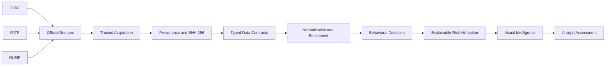
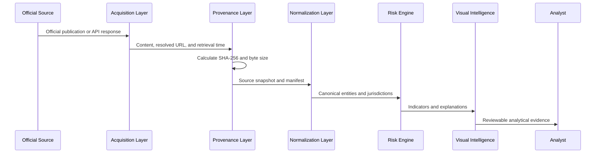

<div align="center">

# Operation Black Meridian

### Provenance-Aware Operational Financial Intelligence

[](https://github.com/valeriusvarda/operation-black-meridian/actions/workflows/quality.yml)


**Official-source acquisition · Cryptographic provenance · Jurisdiction intelligence · Behavioral risk · Explainable analysis**

</div>

---

## Mission

**Operation Black Meridian** is a provenance-aware operational financial-intelligence
platform for transforming official external data and controlled transaction behavior into
reproducible, explainable, and reviewable risk evidence.

The project is built around one central requirement:

> A financial-risk conclusion is defensible only when its source, transformation path,
> assumptions, uncertainty, and analytical evidence can be reconstructed.

Data provenance, model transparency, behavioral context, testing, and visual communication
are therefore treated as parts of one analytical system.

---

## The Problem

Financial risk cannot be evaluated through transaction value alone.

A defensible analytical assessment may require the interaction of:

- transaction timing and velocity
- cross-border exposure
- official jurisdiction classifications
- sanctions and legal-entity reference data
- counterparty concentration
- account-state changes
- behavioral deviation from baseline
- source freshness and cryptographic identity
- uncertainty-aware analyst interpretation

Static country lists, undocumented CSV files, isolated anomaly rules, and unexplained risk
scores do not provide sufficient evidence for serious analytical work.

Operation Black Meridian is being developed to connect those layers through a reproducible
evidence chain.

---

## Intelligence Architecture



### Evidence lifecycle



---

## Current Capability Boundary

| Capability | Status |
|---|---|
| Reproducible Python 3.13 package | Implemented |
| Deterministic dependency lockfile | Implemented |
| Strict Ruff linting and formatting | Implemented |
| Strict MyPy validation | Implemented |
| Hosted GitHub Actions quality gate | Implemented |
| Pytest and coverage evidence | Implemented |
| Trusted official-source registry | Implemented |
| Streaming source acquisition | Implemented |
| SHA-256 snapshot calculation | Implemented |
| Atomic destination replacement | Implemented |
| Machine-readable provenance manifests | Implemented |
| Source discovery CLI | Implemented |
| Approved-source retrieval CLI | Implemented |
| FATF jurisdiction data contracts | Implemented |
| Live FATF HTML parser | Implemented |
| FATF parser public API | Implemented |
| ISO alpha-3 jurisdiction normalization | In progress |
| FATF CSV and JSON exports | Planned |
| Canonical OFAC entity models | Planned |
| GLEIF entity enrichment | Planned |
| Behavioral transaction engine | Planned |
| Explainable risk attribution | Planned |
| Visual intelligence suite | Planned |

---

## Trusted Source Boundary

The trusted source registry currently includes official publications and APIs from:

| Publisher | Intelligence role |
|---|---|
| U.S. Department of the Treasury — OFAC | Sanctions and designated-party reference data |
| Financial Action Task Force — FATF | High-risk and increased-monitoring jurisdictions |
| Global Legal Entity Identifier Foundation — GLEIF | Legal Entity Identifier reference data |

The command interface accepts registered source keys rather than arbitrary user-provided
URLs.

Each retrieved snapshot is designed to preserve:

- registry source key
- requested URL
- resolved URL
- retrieval timestamp
- content type
- byte size
- SHA-256 digest
- local destination
- machine-readable provenance manifest

---

## Command Interface

### List approved sources

```bash
uv run black-meridian sources list
```

### Retrieve the OFAC SDN dataset

```bash
uv run black-meridian sources fetch ofac_sdn_csv
```

### Select a destination directory

```bash
uv run black-meridian sources fetch \
  ofac_sdn_csv \
  --output-dir data/raw/external
```

### Apply a bounded timeout

```bash
uv run black-meridian sources fetch \
  fatf_monitored_jurisdictions_html \
  --timeout 60
```

Downloaded external snapshots and their manifests remain outside Git history.

---

## Installation

### Requirements

- Git
- Python 3.13
- `uv`
- macOS or Linux

### Clone and synchronize

```bash
git clone https://github.com/valeriusvarda/operation-black-meridian.git
cd operation-black-meridian

uv sync --locked --all-groups
```

### Inspect the CLI

```bash
uv run black-meridian --help
uv run black-meridian sources --help
```

---

## Validation

Run the same major quality boundary used by the hosted workflow:

```bash
uv sync --locked --all-groups
uv run ruff check .
uv run ruff format --check .
uv run mypy src
uv run pytest
uv build
```

The GitHub Actions workflow validates:

- lockfile synchronization
- Ruff linting
- Ruff formatting
- strict MyPy analysis
- Pytest with coverage
- wheel construction
- source-distribution construction
- test and coverage artifact publication
- package artifact publication

---

## Repository Structure

```text
operation-black-meridian/
├── .github/
│   ├── ISSUE_TEMPLATE/
│   ├── workflows/
│   └── pull_request_template.md
├── .vscode/
├── data/
│   ├── raw/
│   ├── reference/
│   ├── processed/
│   └── exports/
├── reports/
├── src/
│   └── black_meridian/
│       ├── data_sources/
│       │   ├── contracts.py
│       │   ├── fetcher.py
│       │   ├── models.py
│       │   └── registry.py
│       ├── fatf/
│       │   ├── __init__.py
│       │   └── parser.py
│       └── cli.py
├── tests/
│   ├── fixtures/
│   │   └── fatf/
│   │       └── publication_page.html
│   └── test_fatf_parser.py
├── pyproject.toml
├── uv.lock
└── README.md
```

---

## Engineering Principles

### Provenance before interpretation

External-source conclusions must remain traceable to exact source snapshots.

### Explainability before scoring

A risk score must expose its contributing indicators, assumptions, and limitations.

### Behavior before isolated rows

Transactions should be interpreted as temporal and relational behavior rather than
independent records.

### Evidence before claims

Repository claims must be supported by tests, manifests, metrics, generated artifacts, or
explicitly stated limitations.

### Reproducibility before presentation

A chart is not analytical evidence unless its input data and generation path can be
reconstructed.

---

## Visual Intelligence Roadmap

The repository will not use decorative or fabricated analytical charts.

Visuals will be added only after they are generated from validated pipeline outputs.

Planned outputs include:

| Visual | Analytical purpose |
|---|---|
| FATF jurisdiction map | Compare official public-list classifications |
| Jurisdiction classification matrix | Show tier structure and publication changes |
| OFAC entity-type distribution | Separate persons, entities, vessels, and aircraft |
| Sanctions-program heatmap | Measure distribution across OFAC programs |
| Transaction activity heatmap | Identify temporal concentration |
| Counterparty network graph | Expose relational concentration and centrality |
| Risk attribution chart | Explain account-level indicators |
| Account risk ranking | Support analyst triage |

---

## Development Protocol

Every material workstream follows:

```text
Real problem
    ↓
GitHub Issue
    ↓
Scoped feature branch
    ↓
One file per commit
    ↓
Immediate push
    ↓
Local quality validation
    ↓
Pull Request
    ↓
Hosted quality evidence
    ↓
Review record
    ↓
Merge
```

Pull Requests are expected to document:

- the linked Issue
- the real problem addressed
- the exact scope boundary
- tests and generated evidence
- review focus
- known limitations
- remaining analytical risk

---

## Roadmap

- [x] Reproducible package foundation
- [x] VS Code and contribution workflow
- [x] Automated GitHub quality gate
- [x] Trusted official-source registry
- [x] Integrity-aware source acquisition
- [x] Hash-backed provenance manifests
- [x] FATF jurisdiction contracts
- [x] Live FATF publication retrieval
- [x] FATF HTML parsing
- [ ] ISO alpha-3 jurisdiction normalization
- [ ] FATF CSV and JSON evidence exports
- [ ] Canonical OFAC sanctions models
- [ ] GLEIF entity enrichment
- [ ] Controlled transaction-behavior generation
- [ ] Temporal anomaly detection
- [ ] Counterparty network intelligence
- [ ] Explainable risk attribution
- [ ] Static visual-intelligence suite
- [ ] Interactive analytical dashboard
- [ ] Executive intelligence report

---

## Analytical Limitations

Operation Black Meridian is an engineering product under active development.

It is not:

- a production sanctions-screening platform
- a substitute for legal or compliance review
- a mechanism for attributing criminal intent
- proof that a flagged entity or transaction is suspicious
- a replacement for human analytical judgment

Jurisdiction classifications, sanctions presence, anomaly indicators, and network proximity
are contextual signals. They must not be interpreted as proof of misconduct.

---

## Author

**Valerius VARDA**

Research and engineering interests include financial infrastructure, quantitative risk,
secure systems, blockchain infrastructure, cybersecurity, FPGA systems, and
intelligence-oriented analytical platforms.

---

<div align="center">

**Operation Black Meridian**

*Source-aware. Behavior-focused. Evidence-driven.*

</div>

